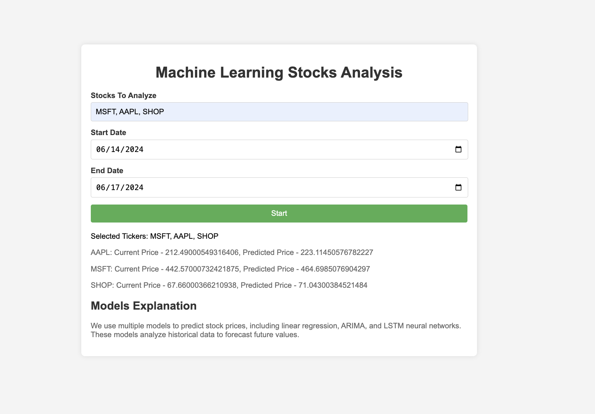

# Stock Future Price

## Website: 
[website](https://github.com/44Jacob/Stock-Future-Price)

## Description
We use multiple models to predict stock prices, including linear regression, ARIMA, and LSTM neural networks. These models analyze historical data to forecast future values.

## Table of Contents
- [Installation](#installation)
- [Usage](#usage)
- [Credits](#credits)
- [License](#license)
- [Features](#features)
- [Tests](#tests)
- [Contact](#contact)

## Installation
sqlite3, numpy, yfinance, pandas, textblob, sqlalchemy, flask, html, css, javascript

## Usage
List the stocks of interest, add start and end dates and click the start button.  This should provide a result of the selected stocks with current and future values.

## Credits
Yakup Altinisik

## License
MIT

## Features
It provides future stock prices.

## Tests
Confirm print out below the start button after hitting start.

## Contact
If there are any questions of concerns, I can be reached at:
##### [github: 44Jacob](https://github.com/44Jacob)
##### [email: jacob@goldenlightrealty.com](mailto:jacob@goldenlightrealty.com)
